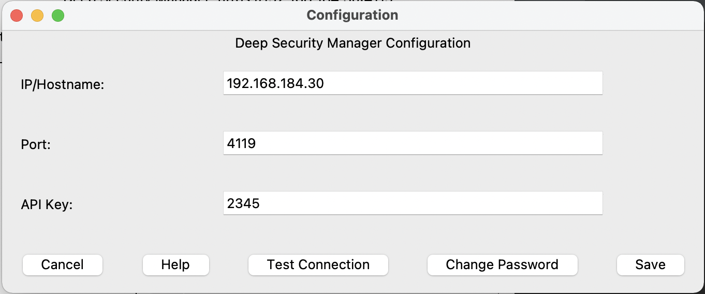
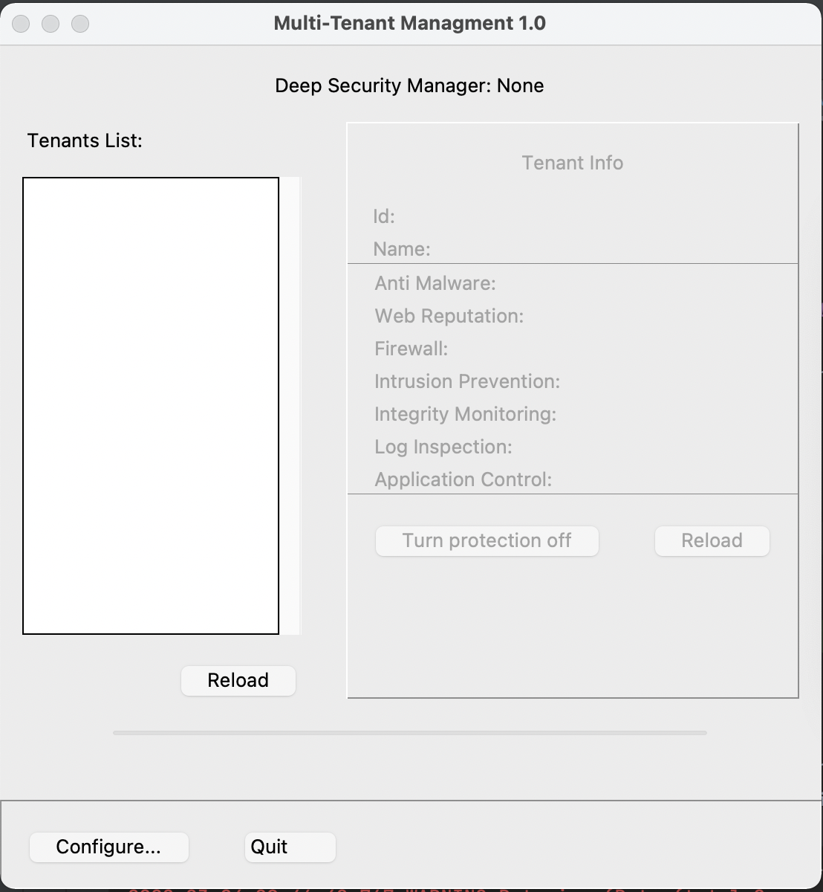

# Multi-tenant Deep Security Managment

~~~~~~~~~~~~~~~~~~~~~~~~~~~~~~~~~~~~~~~~~~~~~~~~~~~~~~~~~~~~~~~~~~~~~~~~~~~~~~~~
MTM 1.0

Turn off protection for Deep Security tenant
~~~~~~~~~~~~~~~~~~~~~~~~~~~~~~~~~~~~~~~~~~~~~~~~~~~~~~~~~~~~~~~~~~~~~~~~~~~~~~~~


## About MTM

MTM provides ability to get list of tenant from Deep Security Manager and
turn off protection for each module on all tenant computers

## System requirements

- Python3 & Tkinter installed
- Deep Security Manager 11.0 or later

## Setup environment

Following instructions are for Linux/macOS.

To run please install python3 (https://www.python.org/downloads/) and tkinter.
The latest can be installed using following command (for macOS):
```commandline
brew install python3-tk
```
or (for Ubuntu flavored Linux):
```commandline
sudo apt-get install python-tk 
```

Then clone this repository and install required packages:

```commandline
git clone https://github.com/mpkondrashin/csp-management.git
cd csp-managementgit 
python3 -m venv venv
source venv/bin/activate
```

Install Deep Security SDK (https://automation.deepsecurity.trendmicro.com/article/20_0/python/):

```commandline
pip install https://automation.deepsecurity.trendmicro.com/sdk/20_0/v1/dsm-py-sdk.zip
```

Install rest of required packages:

```commandline
pip install -r requirements.txt
```

## Switch off all tenant security fetatures

Use following command to run script:
```commandline
python mtm.py
```


### GUI image


Configuration window


Main window

